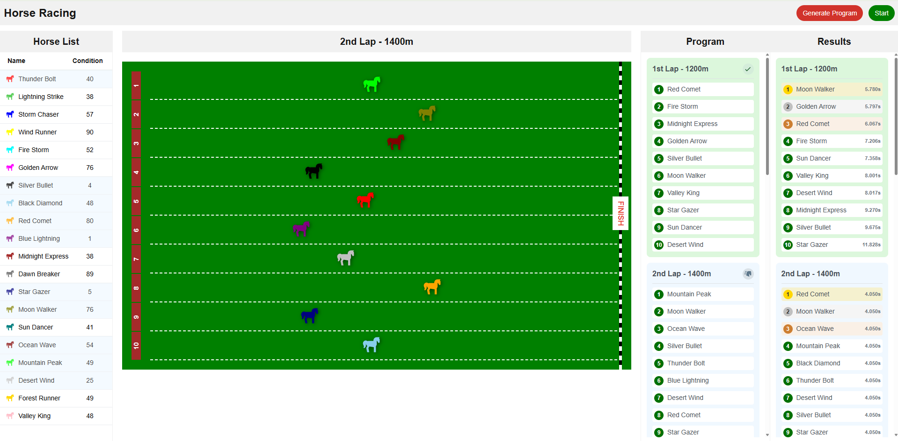

# Horse Racing Game 🐎

A dynamic horse racing simulation game built with Vue 3, Vuex and TypeScript.

()

## Features

- 20 unique horses with different conditions and colors
- 6 racing rounds with varying distances (1200m to 2200m)
- Real-time race visualization
- Race program management
- Race results tracking
- Pause and resume race functionality

## Tech Stack

- Vue 3 with TypeScript
- Vuex for state management
- SCSS for styling
- Jest for testing
- Vite for build tooling
- Unplugin Icons for icon management

## Getting Started

### Installation

1. Clone the repository:
```bash
git clone https://github.com/busrozmen/horse-racing.git
cd horse-racing
```

2. Install dependencies:
```bash
yarn install
```

3. Start development server:
```bash
yarn dev
```

The application will be available at `http://localhost:3000`

## Testing

Run unit tests:

```bash
yarn test
```